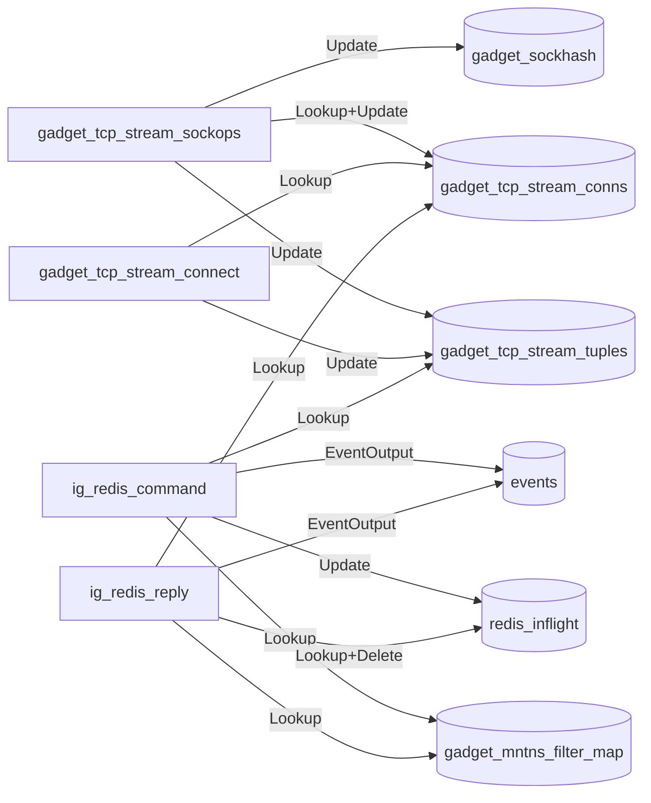
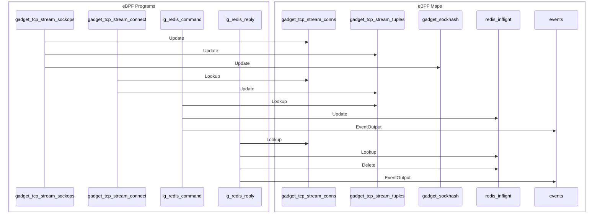

# Developer Notes

This file complements the README file with implementation details specific to this gadget. It includes diagrams that illustrate how eBPF programs interact with eBPF maps. These visualizations help clarify the internal data flow and logic, making it easier to understand, maintain, and extend the gadget.

## Program-Map interactions

The following diagrams are a best-effort representation of the actual interactions, as they do not account for conditionals in the code that may prevent certain program–map interactions from occurring at runtime.

The `sock_ops` and `fexit/tcp_connect` programs (`gadget_tcp_stream_sockops`, `gadget_tcp_stream_connect`) are **owned and attached by the framework** (`pkg/sockhash`, the `Sockhash` operator), not compiled into this gadget: they populate the connection tables and add sockets to the sockhash. The gadget only declares the shared maps via `<gadget/tcp_stream.h>` (the framework injects its instances through `MapReplacements`) and adds two programs of its own: `ig_redis_command` (`sk_msg`, send path) and `ig_redis_reply` (`sk_skb/stream_verdict`, receive path). The diagrams below include the framework programs (dashed) to show the full data flow.

### Flowchart

### Sequence Diagram

